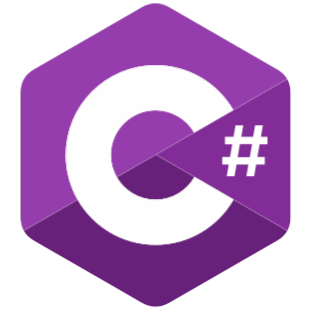
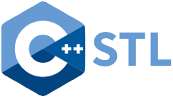
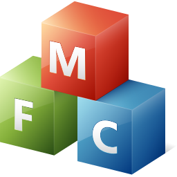
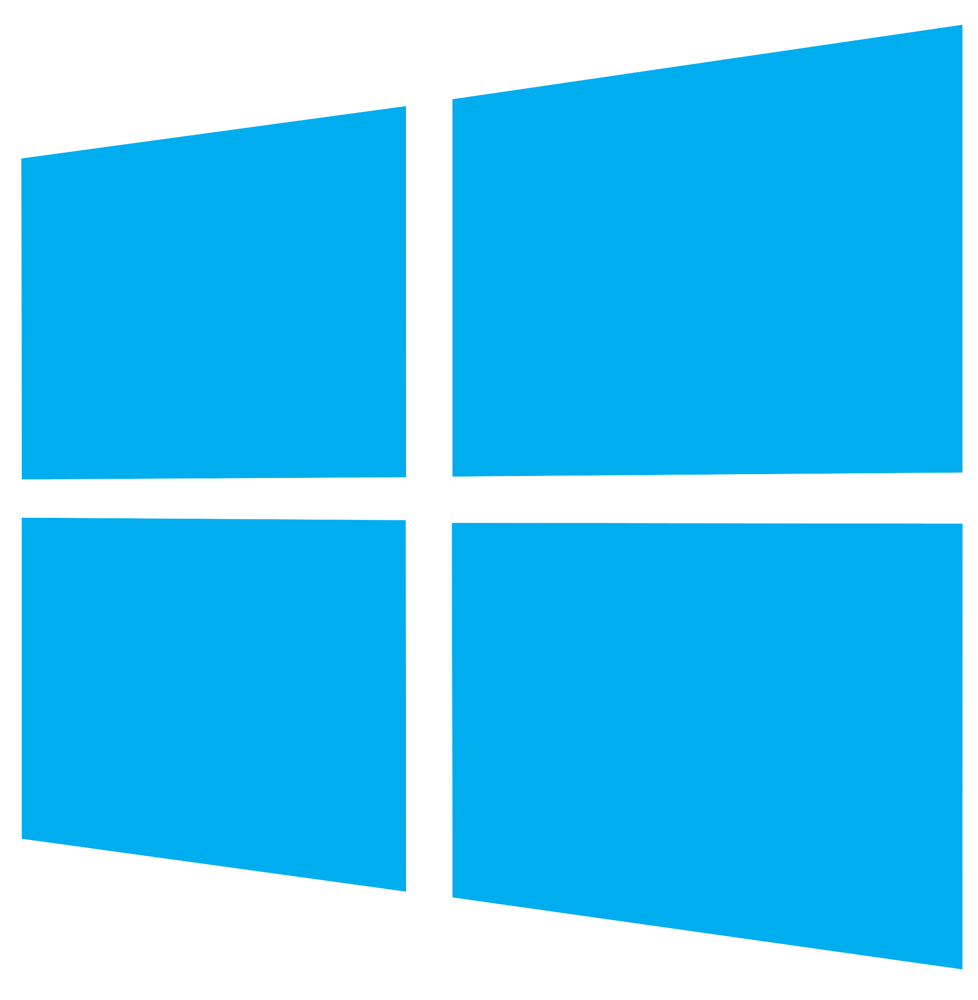
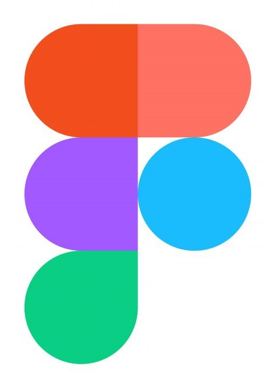
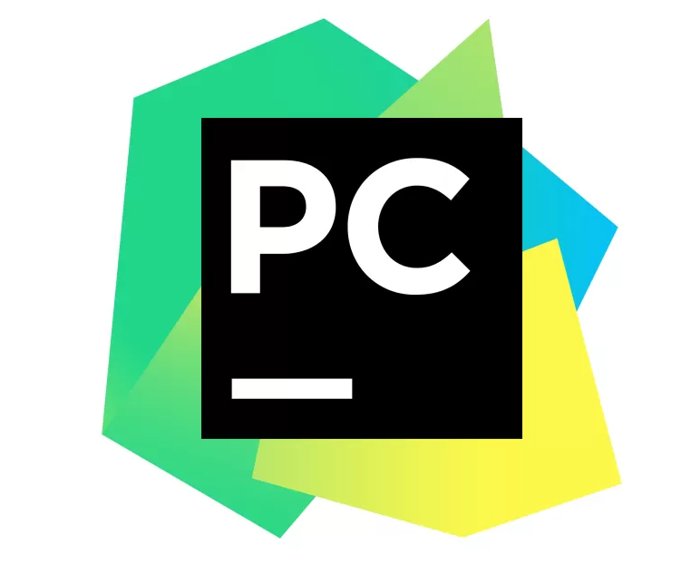
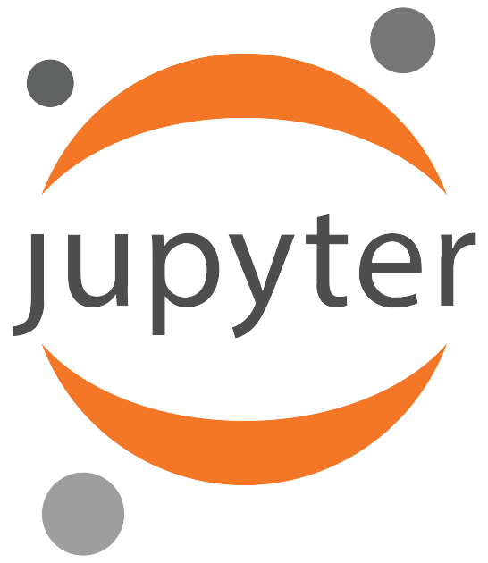

<h1 align="center">Hi 👋, I'm Shayan</h1>

Experienced software engineer with over 3 years of expertise in C++, C, and C#, specializing in developing high-performance applications on UNIX and Windows. Proficient in WPF, MFC, CUDA, STL, and adept with Git, Teams Foundation Server, CMake, Embedded development on ARM architecture, ESP-IDF. Committed to optimizing complex systems and delivering robust, cutting-edge solutions.

- 🧑‍💻 I have worked with     
   

- 🔧 I have extensive experience with     
   
- 🖥️ Developed applications for   
   
- 🔧 Experienced with source control tools like   
   

- 🛠️ Worked with embedded platforms like    
   
- ⚙️ Proficient with tools like      
   
- 🖥️ Experienced with editors/IDEs like      
   

 

