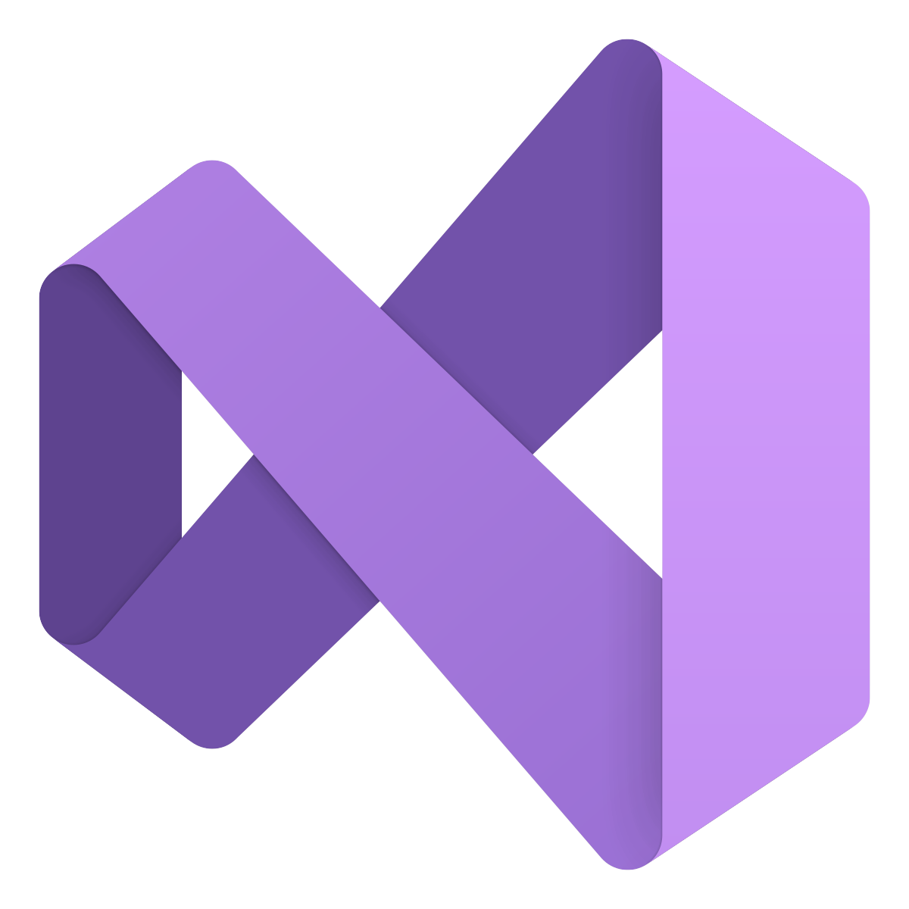

<h1 align="center">Hi 👋, I'm Shayan</h1>

Dynamic software engineer with 3+ years in C++, C, and C#, excelling in high-performance app development on UNIX and Windows. Expert in WPF, MFC, CUDA, and STL, known for optimizing complex systems and delivering innovative solutions.

 
 
- 🧑‍💻 I have worked with     
   

- 🔧 I have extensive experience with     
   
- 🖥️ Developed applications for   
   
- 🔧 Experienced with source control tools like   
   

- 🛠️ Worked with embedded platforms like     
   
- ⚙️ Proficient with tools like      
   
- 🖥️ Experienced with editors/IDEs like      
   

 

